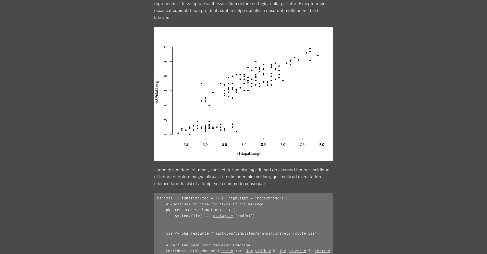

# rmdfmt

[](https://www.repostatus.org/#active)
[]()
[](https://www.gnu.org/licenses/gpl-3.0.en.html)

The rmdfmt package contains HTML output formats for R Markdown documents, with an emphasis on minimalist design for readability.


## Installation

To install, use the `remotes` package:

```{r}
remotes::install_gitlab("drkrynstrng/rmdfmt")
```


## Usage

In the YAML metadata for an R Markdown document, set the output to one of the formats in this package. For example:

```
---
title: "Title"
author: "Author"
date: "`r Sys.Date()`"
output:
  rmdfmt::minimal:
    toc: true
---
```

Available formats:

- minimal


- minimal_dark



## License

[GPL-3](https://www.gnu.org/licenses/gpl-3.0.en.html)
